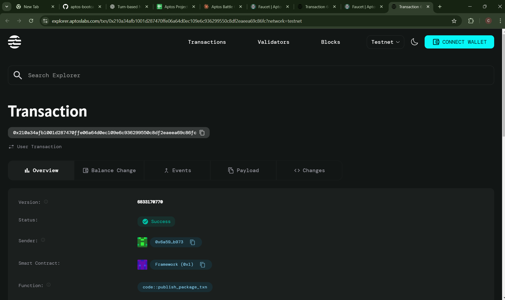

# Battle Game System

## Project Description

The Battle Game System is a decentralized turn-based battle game built on the Aptos blockchain. Players can create unique NFT characters with distinct battle statistics and engage in strategic turn-based combat against other players. Each character is represented as a non-fungible token with persistent stats including health, attack power, defense, and level progression.

## Project Vision

Our vision is to create an engaging blockchain-based gaming ecosystem where players truly own their game assets through NFTs. We aim to revolutionize traditional gaming by providing:

- **True Digital Ownership**: Characters exist as NFTs that players fully own and control
- **Transparent Gameplay**: All battle mechanics are executed on-chain for complete transparency
- **Decentralized Competition**: Peer-to-peer battles without centralized game servers
- **Cross-Platform Compatibility**: Characters can potentially be used across multiple games
- **Community-Driven Evolution**: Player feedback directly influences game development

## Key Features

### 🎮 **NFT Character Creation**
- Create unique battle characters with customizable stats
- Each character is minted as an NFT with immutable ownership
- Persistent character progression and level system

### ⚔️ **Turn-Based Battle System**
- Strategic combat mechanics with attack and defense calculations
- Real-time battle state management on the blockchain
- Winner determination based on character stats and battle strategy

### 🏆 **Competitive Gaming**
- Player vs Player (PvP) battle functionality
- Battle history and statistics tracking
- Leaderboard system for competitive rankings

### 🔒 **Blockchain Security**
- All game logic executed on Aptos blockchain
- Immutable battle results and character ownership
- Transparent and tamper-proof game mechanics

### 📊 **Character Progression**
- Level-based character advancement system
- Health, attack, and defense stat improvements
- Character rarity and special abilities

## Future Scope

### Phase 1: Core Enhancement
- **Advanced Battle Mechanics**: Introduction of special abilities, elemental types, and combo attacks
- **Character Marketplace**: Built-in trading system for buying/selling NFT characters
- **Tournament System**: Organized competitions with prize pools

### Phase 2: Ecosystem Expansion
- **Guild System**: Team-based gameplay and cooperative battles
- **Breeding Mechanism**: Create new characters by combining existing NFTs
- **Multi-Chain Support**: Expand to other blockchain networks for broader accessibility

### Phase 3: Metaverse Integration
- **3D Battle Arena**: Immersive visual battle experiences
- **Virtual World**: Explorable game world with quests and adventures
- **Cross-Game Compatibility**: Use characters in partner games and platforms

### Phase 4: Advanced Features
- **AI-Powered NPCs**: Intelligent computer opponents for single-player modes
- **Dynamic Economy**: Token rewards, staking, and yield farming mechanisms
- **Community Governance**: DAO structure for game development decisions

## Technology Stack

- **Blockchain**: Aptos Network
- **Smart Contract Language**: Move
- **Token Standard**: Aptos Token Standard for NFTs
- **Frontend**: React.js with Web3 integration
- **Wallet Integration**: Aptos Wallet Adapter

## Getting Started

### Prerequisites
- Aptos CLI installed
- Move development environment set up
- Aptos testnet/mainnet wallet

### Installation
```bash
# Clone the repository
git clone https://github.com/yourusername/battle-game-system

# Navigate to project directory
cd battle-game-system

# Compile the smart contract
aptos move compile

# Deploy to testnet
aptos move publish --profile testnet
```

## Contract Details

0x210a34afb1001d287470ffe06a64d0ec109e6c936299550c8df2eaeea69c86fc


## Contributing

We welcome contributions from the community! Please read our contributing guidelines and submit pull requests for any improvements.

## License

This project is licensed under the MIT License - see the LICENSE file for details.

## Support

For support, email support@battlegamesystem.com or join our Discord community.

---

**Join the Revolution of Blockchain Gaming!** 🚀